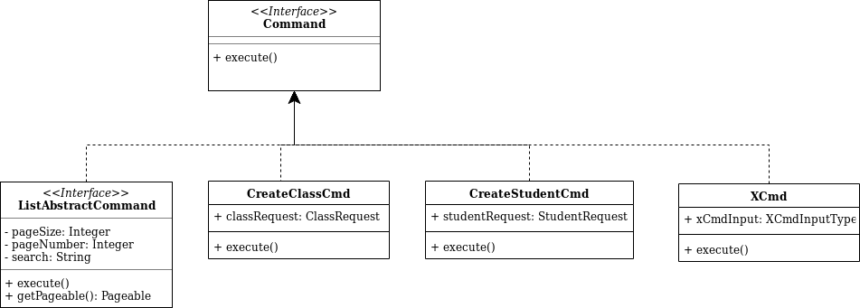

###Student Class Assignation - API REST

####Tech stack
* Spring Boot 2.1.8.RELEASE
* Java 1.8
* JPA
* H2
* Swagger 2.9.2

####Design Decisions 
**Commands**
* Each command runs a single and atomic operation. Command has been used for each of the data operations. 
* This approach has been taken in order to have each  operations as  an injectable command that takes care of only one operation.
* An additional advantage of doing this is that in the future we could refactor and add pre and post execute events.   
* Find below the class diagram:

