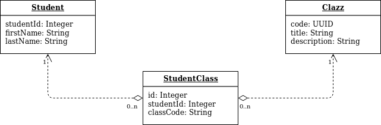

### Student Class Assignation - API REST

#### Tech stack
* Spring Boot 2.1.8.RELEASE
* Java 1.8
* JPA
* H2
* Swagger 2.9.2

#### Design Decisions 
**Commands**
* Each command runs a single and atomic operation. Command has been used for each of the data operations. 
* This approach has been taken in order to have each  operations as  an injectable command that takes care of only one operation.
* An additional advantage of doing this is that in the future we could refactor and add pre and post execute events.   
* Find below the class diagram:

**Repositories**
* JPA repositories has been used for each of the entities.
* JpaSpecificationExecutor interface has been implemented for the searchable entities. 

#### Domain Model 

### How to use 
#### Create artifact
* This is a maven project. To build the artifact run:
`mvn package`
* This will create a jar file
* Runt jar file with: `restapi-0.0.1-SNAPSHOT.jar`
* A Docker file has been added to build an image. However, it is required to build the artifact before creating the image
* Port 9090  is used. Therefore access to the API using {host}:9090/
#### API DOC

**Student**
**Controller**: _rest/StudentController.java_
###### Create
* Path: `/student`
* Method: POST
* Payload: StudentRequest

| Attribute | Type | Description |
|-----------|------|-------------|
|firstName|String|Student First Name|
|lastName|String|Student Last Name|

* Response: StudentRequest

###### Update
* Path: `/student/{id}`
* Method: PATCH
* Path variable: {id} to be replaced studentId
* Payload: StudentRequest

| Attribute | Type | Description |
|-----------|------|-------------|
|firstName|String|Student First Name|
|lastName|String|Student Last Name|

* Response: None

###### Delete
* Path: `/student/{id}`
* Method: DELETE
* Path variable: {id} to be replaced studentId
* Response: None

###### Get
* Path: `/student/`
* Method: GET
* Request Params

| Param | Type | Required | Default | Format
|-------|------|----------|---------|-------|
|pageNumber|Integer|No|0|
|pageSize|Integer|No|--|
|search|String|No|--| `column:value`|
* Response: Paged Students List

